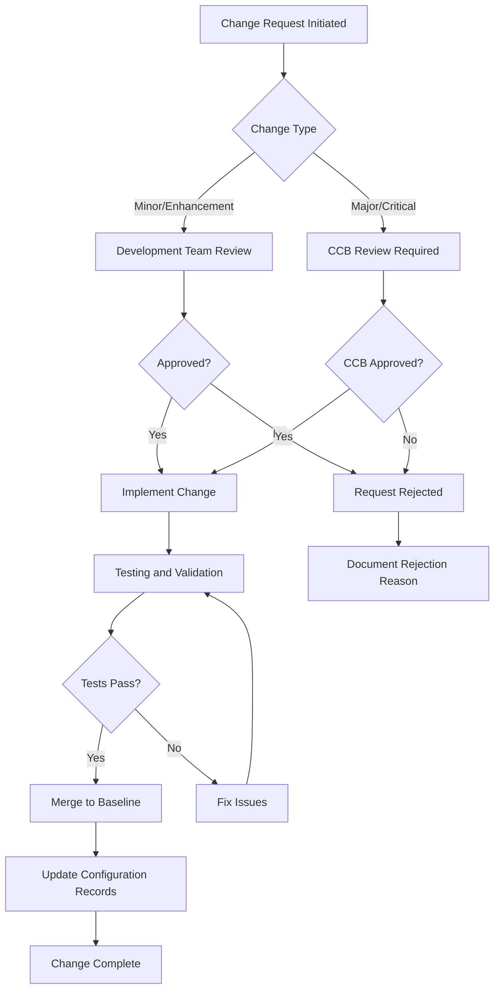

# Software Configuration Management Plan (SCMP)
## Medical Imaging AI Platform - Tumor Detection and Segmentation

**Document ID**: SCMP-MIAP-001
**Version**: 1.0
**Date**: September 13, 2025
**Classification**: Unclassified
**Prepared by**: Configuration Management Team
**Approved by**: Configuration Manager

---

## 1. INTRODUCTION

### 1.1 Purpose

This Software Configuration Management Plan (SCMP) establishes the configuration management (CM) approach for the Medical Imaging AI Platform (MIAP) following NASA-STD-8739.8 standards. The plan ensures systematic control of all software configuration items throughout the development and operational lifecycle.

### 1.2 Scope

This plan covers configuration management for:

- **Source Code**: All Python modules, configuration files, and scripts
- **Documentation**: Requirements, design, test, and user documentation
- **Build Artifacts**: Docker images, compiled binaries, and deployment packages
- **Configuration Data**: Environment settings, model configurations, and system parameters
- **Test Artifacts**: Test data, test scripts, and test results
- **Infrastructure Code**: Docker configurations, CI/CD pipelines, and deployment scripts

### 1.3 Configuration Management Objectives

**Primary Objectives:**

- Maintain complete traceability from requirements to deployed software
- Ensure reproducible builds and deployments across all environments
- Control changes to prevent unauthorized modifications
- Enable rapid rollback to previous stable configurations
- Support parallel development and efficient branching strategies
- Maintain audit trails for regulatory compliance

---

## 2. CONFIGURATION MANAGEMENT ORGANIZATION

### 2.1 Roles and Responsibilities

| Role | Responsibilities | Authority Level |
|------|------------------|-----------------|
| **Configuration Manager** | Overall CM process oversight, policy enforcement | Full authority over CM processes |
| **Configuration Control Board (CCB)** | Review and approve critical changes | Approval authority for baseline changes |
| **Development Team Lead** | Implement CM procedures, manage team compliance | Team-level change approval |
| **Release Manager** | Coordinate releases, manage deployment artifacts | Release process authority |
| **Quality Assurance Lead** | Verify CM compliance, audit configurations | CM compliance verification |
| **DevOps Engineer** | Maintain CI/CD infrastructure, automate CM processes | Infrastructure change authority |

### 2.2 Configuration Control Board (CCB)

**CCB Composition:**

- Configuration Manager (Chair)
- System Architect
- Development Team Lead
- Quality Assurance Lead
- Clinical Integration Lead
- Security Officer

**CCB Responsibilities:**

- Review and approve changes to established baselines
- Evaluate change impact on system requirements and architecture
- Coordinate change implementation across multiple teams
- Resolve configuration conflicts and dependencies
- Approve emergency changes and hotfixes

**CCB Meeting Schedule:**

- **Regular Meetings**: Weekly during active development
- **Emergency Meetings**: As needed for critical issues
- **Release Planning**: Bi-weekly during release preparation

---

## 3. CONFIGURATION IDENTIFICATION

### 3.1 Configuration Item Identification Scheme

**Naming Convention:**

```
<Component>-<Type>-<Version>-<Build>-<Environment>

Examples:
- MIAP-API-v1.2.3-b456-prod
- MIAP-MODEL-v2.1.0-b123-staging
- MIAP-DOCS-v1.0.0-b001-release
```

**Component Codes:**

| Code | Component | Description |
|------|-----------|-------------|
| **MIAP-API** | API Service | FastAPI application and endpoints |
| **MIAP-AI** | AI Engine | PyTorch/MONAI models and inference |
| **MIAP-DATA** | Data Processing | DICOM processing and validation |
| **MIAP-WEB** | Web Interface | React/Vue.js frontend application |
| **MIAP-DB** | Database | PostgreSQL schemas and migrations |
| **MIAP-CONFIG** | Configuration | Environment and system configurations |
| **MIAP-DOCS** | Documentation | All project documentation |
| **MIAP-TEST** | Test Suite | Automated tests and test data |

### 3.2 Configuration Items Hierarchy

```
Medical Imaging AI Platform (MIAP)
├── Source Code Components
│   ├── MIAP-API (API Service)
│   │   ├── src/api/
│   │   ├── requirements-api.txt
│   │   └── Dockerfile.api
│   ├── MIAP-AI (AI Engine)
│   │   ├── src/models/
│   │   ├── src/training/
│   │   └── requirements-ai.txt
│   ├── MIAP-DATA (Data Processing)
│   │   ├── src/data/
│   │   └── requirements-data.txt
│   └── MIAP-WEB (Web Interface)
│       ├── frontend/src/
│       ├── package.json
│       └── Dockerfile.web
├── Configuration Items
│   ├── MIAP-CONFIG-ENV (Environment Variables)
│   ├── MIAP-CONFIG-DOCKER (Docker Configurations)
│   └── MIAP-CONFIG-CI (CI/CD Pipelines)
├── Documentation Items
│   ├── MIAP-DOCS-REQ (Requirements Documentation)
│   ├── MIAP-DOCS-DESIGN (Design Documentation)
│   └── MIAP-DOCS-TEST (Test Documentation)
└── Build Artifacts
    ├── MIAP-ARTIFACT-DOCKER (Docker Images)
    ├── MIAP-ARTIFACT-WHEEL (Python Packages)
    └── MIAP-ARTIFACT-RELEASE (Release Packages)
```

### 3.3 Configuration Item Attributes

**Required Attributes for All CIs:**

| Attribute | Description | Example |
|-----------|-------------|---------|
| **CI_ID** | Unique configuration item identifier | MIAP-API-001 |
| **Version** | Semantic version number | v1.2.3 |
| **Build_Number** | Incremental build identifier | b456 |
| **Created_Date** | Creation timestamp | 2025-09-13T10:30:00Z |
| **Author** | Creator identification | john.doe@company.com |
| **Status** | Current CI status | DEVELOPMENT, TESTED, RELEASED |
| **Description** | Brief CI description | Main API service module |
| **Dependencies** | List of dependent CIs | MIAP-AI-001, MIAP-DATA-001 |
| **Environment** | Target deployment environment | development, staging, production |
| **Checksum** | File integrity verification | SHA-256 hash |

---

## 4. CONFIGURATION CONTROL

### 4.1 Baseline Management

**Baseline Types:**

| Baseline Type | Description | Approval Authority | Change Control |
|---------------|-------------|-------------------|----------------|
| **Development Baseline** | Working development code | Development Team Lead | Informal review |
| **Test Baseline** | Code ready for testing | QA Lead | Formal review |
| **Release Baseline** | Approved for production | CCB | Formal change control |
| **Production Baseline** | Currently deployed code | Configuration Manager | Emergency change only |

**Baseline Establishment Process:**

1. **Development Completion**: All planned features implemented and unit tested
2. **Quality Gate Review**: Code review, static analysis, and security scanning
3. **Integration Testing**: All integration tests passing
4. **Documentation Update**: All documentation current and reviewed
5. **Baseline Approval**: CCB approval for release baseline
6. **Baseline Tagging**: Git tag creation with baseline identifier
7. **Artifact Generation**: Creation of deployment-ready artifacts

### 4.2 Change Control Process

#### 4.2.1 Change Request Workflow



#### 4.2.2 Change Classification

| Change Class | Description | Approval Required | Testing Required |
|--------------|-------------|-------------------|------------------|
| **Class 1 - Critical** | Security fixes, data loss prevention | CCB + Emergency approval | Full regression testing |
| **Class 2 - Major** | New features, architecture changes | CCB approval | Full test suite |
| **Class 3 - Minor** | Bug fixes, enhancements | Team Lead approval | Affected component testing |
| **Class 4 - Trivial** | Documentation, comments, formatting | Peer review | Static analysis only |

#### 4.2.3 Emergency Change Process

**Emergency Change Criteria:**

- Critical security vulnerabilities
- Production system failures
- Data corruption or loss
- Patient safety concerns

**Emergency Process:**

1. **Immediate Assessment**: Configuration Manager evaluates urgency
2. **Emergency Authorization**: CCB Chair provides verbal approval
3. **Implementation**: Minimal viable fix implementation
4. **Post-Implementation Review**: Full CCB review within 24 hours
5. **Documentation**: Complete change documentation within 48 hours

### 4.3 Version Control Strategy

#### 4.3.1 Git Branching Model

**GitFlow-Based Branching Strategy:**

```
main (production-ready)
├── develop (integration branch)
│   ├── feature/MIAP-123-tumor-detection
│   ├── feature/MIAP-124-api-enhancement
│   └── feature/MIAP-125-ui-improvement
├── release/v1.2.0 (release preparation)
└── hotfix/v1.1.1-security-patch (emergency fixes)
```

**Branch Types and Policies:**

| Branch Type | Purpose | Naming Convention | Merge Policy |
|-------------|---------|-------------------|--------------|
| **main** | Production releases | main | Protected, CCB approval required |
| **develop** | Integration testing | develop | Protected, automated testing required |
| **feature/** | Feature development | feature/MIAP-###-description | Pull request + review |
| **release/** | Release preparation | release/v#.#.# | Pull request + QA approval |
| **hotfix/** | Emergency fixes | hotfix/v#.#.#-description | Expedited review process |

#### 4.3.2 Commit Standards

**Conventional Commit Format:**

```
<type>(<scope>): <subject>

<body>

<footer>
```

**Commit Types:**

- **feat**: New feature implementation
- **fix**: Bug fix
- **docs**: Documentation changes
- **style**: Code formatting changes
- **refactor**: Code refactoring
- **test**: Test additions or modifications
- **chore**: Build system or dependency updates

**Example Commits:**

```
feat(ai-engine): implement UNETR model for tumor segmentation

- Add UNETR model architecture implementation
- Integrate with MONAI framework
- Add model configuration validation
- Update training pipeline for new model

Fixes: MIAP-123
Reviewed-by: jane.smith@company.com
Tested-by: qa-team@company.com
```

---

## 5. CONFIGURATION STATUS ACCOUNTING

### 5.1 Configuration Database

**Configuration Management Database (CMDB) Schema:**

```sql
-- Configuration Items table
CREATE TABLE configuration_items (
    ci_id VARCHAR(50) PRIMARY KEY,
    name VARCHAR(255) NOT NULL,
    type VARCHAR(50) NOT NULL,
    version VARCHAR(20) NOT NULL,
    build_number INTEGER,
    status VARCHAR(20) NOT NULL,
    created_date TIMESTAMP WITH TIME ZONE,
    created_by VARCHAR(255),
    description TEXT,
    checksum VARCHAR(64),
    file_path TEXT,
    repository_url TEXT,
    commit_hash VARCHAR(40)
);

-- Dependencies table
CREATE TABLE ci_dependencies (
    id SERIAL PRIMARY KEY,
    ci_id VARCHAR(50) REFERENCES configuration_items(ci_id),
    dependency_ci_id VARCHAR(50) REFERENCES configuration_items(ci_id),
    dependency_type VARCHAR(20), -- 'REQUIRES', 'USES', 'INCLUDES'
    created_date TIMESTAMP WITH TIME ZONE DEFAULT NOW()
);

-- Change requests table
CREATE TABLE change_requests (
    cr_id VARCHAR(20) PRIMARY KEY,
    title VARCHAR(255) NOT NULL,
    description TEXT,
    requestor VARCHAR(255) NOT NULL,
    priority VARCHAR(10) NOT NULL, -- HIGH, MEDIUM, LOW
    status VARCHAR(20) NOT NULL, -- SUBMITTED, APPROVED, REJECTED, IMPLEMENTED
    created_date TIMESTAMP WITH TIME ZONE DEFAULT NOW(),
    approved_date TIMESTAMP WITH TIME ZONE,
    approved_by VARCHAR(255),
    implementation_date TIMESTAMP WITH TIME ZONE,
    affected_cis TEXT[] -- Array of affected CI IDs
);

-- Build history table
CREATE TABLE build_history (
    build_id SERIAL PRIMARY KEY,
    ci_id VARCHAR(50) REFERENCES configuration_items(ci_id),
    build_number INTEGER NOT NULL,
    build_date TIMESTAMP WITH TIME ZONE DEFAULT NOW(),
    build_status VARCHAR(20) NOT NULL, -- SUCCESS, FAILED, IN_PROGRESS
    build_duration INTEGER, -- seconds
    git_commit_hash VARCHAR(40),
    build_artifacts JSONB,
    test_results JSONB
);
```

### 5.2 Status Reporting

#### 5.2.1 Automated Status Collection

```python
class ConfigurationStatusCollector:
    """
    Automated collection of configuration status information
    """

    def __init__(self):
        self.cmdb = ConfigurationDatabase()
        self.git_client = GitClient()
        self.build_system = BuildSystem()
        self.docker_registry = DockerRegistry()

    async def collect_configuration_status(self) -> ConfigurationStatusReport:
        """Collect comprehensive configuration status"""

        # Collect CI status from multiple sources
        git_status = await self._collect_git_status()
        build_status = await self._collect_build_status()
        deployment_status = await self._collect_deployment_status()
        dependency_status = await self._collect_dependency_status()

        # Generate status report
        return ConfigurationStatusReport(
            timestamp=datetime.utcnow(),
            git_status=git_status,
            build_status=build_status,
            deployment_status=deployment_status,
            dependency_status=dependency_status,
            overall_health=self._calculate_overall_health(
                git_status, build_status, deployment_status
            )
        )

    async def _collect_git_status(self) -> GitStatus:
        """Collect Git repository status"""

        branches = await self.git_client.get_all_branches()
        commits_ahead_behind = {}

        for branch in branches:
            ahead, behind = await self.git_client.get_commits_ahead_behind(
                branch, 'main'
            )
            commits_ahead_behind[branch] = {'ahead': ahead, 'behind': behind}

        return GitStatus(
            active_branches=branches,
            commits_ahead_behind=commits_ahead_behind,
            pending_pull_requests=await self.git_client.get_pending_prs(),
            last_commit_date=await self.git_client.get_last_commit_date('main')
        )

    async def _collect_build_status(self) -> BuildStatus:
        """Collect CI/CD build status"""

        recent_builds = await self.build_system.get_recent_builds(limit=50)

        build_stats = {
            'total_builds': len(recent_builds),
            'successful_builds': len([b for b in recent_builds if b.status == 'SUCCESS']),
            'failed_builds': len([b for b in recent_builds if b.status == 'FAILED']),
            'average_build_time': sum(b.duration for b in recent_builds) / len(recent_builds)
        }

        return BuildStatus(
            recent_builds=recent_builds[:10],  # Last 10 builds
            build_statistics=build_stats,
            current_build_queue=await self.build_system.get_build_queue()
        )

    async def _collect_deployment_status(self) -> DeploymentStatus:
        """Collect deployment environment status"""

        environments = ['development', 'staging', 'production']
        environment_status = {}

        for env in environments:
            deployed_version = await self.docker_registry.get_deployed_version(env)
            health_status = await self._check_environment_health(env)

            environment_status[env] = {
                'deployed_version': deployed_version,
                'health': health_status,
                'last_deployment': await self._get_last_deployment_date(env)
            }

        return DeploymentStatus(
            environments=environment_status,
            pending_deployments=await self._get_pending_deployments()
        )
```

#### 5.2.2 Status Dashboard

**Real-time Configuration Dashboard:**

```python
from fastapi import FastAPI
from fastapi.responses import HTMLResponse
import plotly.graph_objects as go
import plotly.utils

class ConfigurationDashboard:
    """
    Real-time configuration management dashboard
    """

    def __init__(self):
        self.app = FastAPI(title="Configuration Management Dashboard")
        self.status_collector = ConfigurationStatusCollector()
        self._setup_routes()

    def _setup_routes(self):
        @self.app.get("/", response_class=HTMLResponse)
        async def dashboard_home():
            return await self._generate_dashboard_html()

        @self.app.get("/api/status")
        async def get_configuration_status():
            return await self.status_collector.collect_configuration_status()

        @self.app.get("/api/metrics")
        async def get_configuration_metrics():
            return await self._generate_configuration_metrics()

    async def _generate_dashboard_html(self) -> str:
        """Generate HTML dashboard with real-time status"""

        status = await self.status_collector.collect_configuration_status()

        # Generate build trend chart
        build_trend_fig = go.Figure()
        build_trend_fig.add_trace(go.Scatter(
            x=[b.date for b in status.build_status.recent_builds],
            y=[b.duration for b in status.build_status.recent_builds],
            mode='lines+markers',
            name='Build Duration',
            line=dict(color='blue', width=2)
        ))

        build_trend_fig.update_layout(
            title='Build Duration Trend',
            xaxis_title='Date',
            yaxis_title='Duration (seconds)',
            height=400
        )

        build_trend_json = plotly.utils.PlotlyJSONEncoder().encode(build_trend_fig)

        # Generate deployment status chart
        deployment_fig = go.Figure(data=[
            go.Bar(
                x=list(status.deployment_status.environments.keys()),
                y=[env['health']['uptime'] for env in status.deployment_status.environments.values()],
                name='Environment Uptime'
            )
        ])

        deployment_fig.update_layout(
            title='Environment Health Status',
            yaxis_title='Uptime (%)',
            height=400
        )

        deployment_json = plotly.utils.PlotlyJSONEncoder().encode(deployment_fig)

        return f"""
        <!DOCTYPE html>
        <html>
        <head>
            <title>Configuration Management Dashboard</title>
            <script src="https://cdn.plot.ly/plotly-latest.min.js"></script>
            <style>
                body {{ font-family: Arial, sans-serif; margin: 20px; }}
                .status-grid {{ display: grid; grid-template-columns: 1fr 1fr; gap: 20px; }}
                .status-card {{ border: 1px solid #ddd; padding: 20px; border-radius: 8px; }}
                .metric {{ font-size: 24px; font-weight: bold; color: #333; }}
                .healthy {{ color: green; }}
                .warning {{ color: orange; }}
                .critical {{ color: red; }}
            </style>
        </head>
        <body>
            <h1>Medical Imaging AI Platform - Configuration Status</h1>

            <div class="status-grid">
                <div class="status-card">
                    <h3>Build Status</h3>
                    <div class="metric healthy">{status.build_status.build_statistics['successful_builds']}</div>
                    <p>Successful Builds (Last 50)</p>
                    <div class="metric {'warning' if status.build_status.build_statistics['failed_builds'] > 0 else 'healthy'}">
                        {status.build_status.build_statistics['failed_builds']}
                    </div>
                    <p>Failed Builds</p>
                </div>

                <div class="status-card">
                    <h3>Git Status</h3>
                    <div class="metric healthy">{len(status.git_status.active_branches)}</div>
                    <p>Active Branches</p>
                    <div class="metric {'warning' if len(status.git_status.pending_pull_requests) > 5 else 'healthy'}">
                        {len(status.git_status.pending_pull_requests)}
                    </div>
                    <p>Pending Pull Requests</p>
                </div>
            </div>

            <div id="build-trend-chart"></div>
            <div id="deployment-status-chart"></div>

            <script>
                Plotly.newPlot('build-trend-chart', {build_trend_json});
                Plotly.newPlot('deployment-status-chart', {deployment_json});

                // Auto-refresh every 30 seconds
                setInterval(function() {{
                    location.reload();
                }}, 30000);
            </script>
        </body>
        </html>
        """
```

---

## 6. CONFIGURATION AUDITING

### 6.1 Audit Planning and Scheduling

**Audit Types and Frequency:**

| Audit Type | Frequency | Scope | Duration |
|------------|-----------|-------|----------|
| **Internal CM Audit** | Monthly | CM process compliance | 2 days |
| **Configuration Baseline Audit** | Per release | Baseline integrity verification | 1 day |
| **Change Control Audit** | Quarterly | Change process effectiveness | 3 days |
| **Tool and Infrastructure Audit** | Semi-annually | CM toolchain assessment | 2 days |
| **Regulatory Compliance Audit** | Annually | FDA/ISO compliance verification | 5 days |

### 6.2 Audit Procedures

#### 6.2.1 Configuration Baseline Audit

```python
class ConfigurationAuditor:
    """
    Automated configuration auditing system
    """

    def __init__(self):
        self.cmdb = ConfigurationDatabase()
        self.git_client = GitClient()
        self.artifact_store = ArtifactStore()
        self.audit_logger = AuditLogger()

    async def audit_configuration_baseline(self, baseline_id: str) -> AuditReport:
        """Perform comprehensive baseline audit"""

        audit_findings = []

        # Audit 1: Baseline Completeness
        completeness_findings = await self._audit_baseline_completeness(baseline_id)
        audit_findings.extend(completeness_findings)

        # Audit 2: Artifact Integrity
        integrity_findings = await self._audit_artifact_integrity(baseline_id)
        audit_findings.extend(integrity_findings)

        # Audit 3: Traceability Verification
        traceability_findings = await self._audit_requirement_traceability(baseline_id)
        audit_findings.extend(traceability_findings)

        # Audit 4: Change Control Compliance
        change_control_findings = await self._audit_change_control_compliance(baseline_id)
        audit_findings.extend(change_control_findings)

        # Generate audit report
        audit_report = AuditReport(
            audit_id=f"AUDIT-{baseline_id}-{datetime.now().strftime('%Y%m%d')}",
            baseline_id=baseline_id,
            audit_date=datetime.utcnow(),
            audit_type="BASELINE_AUDIT",
            findings=audit_findings,
            overall_compliance=self._calculate_compliance_score(audit_findings),
            recommendations=self._generate_audit_recommendations(audit_findings)
        )

        # Log audit completion
        await self.audit_logger.log_audit_completion(audit_report)

        return audit_report

    async def _audit_baseline_completeness(self, baseline_id: str) -> List[AuditFinding]:
        """Verify baseline contains all required configuration items"""

        findings = []

        # Get baseline configuration items
        baseline_cis = await self.cmdb.get_baseline_configuration_items(baseline_id)

        # Expected CI types for complete baseline
        required_ci_types = [
            'SOURCE_CODE',
            'DOCUMENTATION',
            'TEST_SCRIPTS',
            'BUILD_SCRIPTS',
            'DEPLOYMENT_CONFIG',
            'DOCKER_IMAGES'
        ]

        # Check for missing CI types
        present_ci_types = set(ci.type for ci in baseline_cis)
        missing_ci_types = set(required_ci_types) - present_ci_types

        if missing_ci_types:
            findings.append(AuditFinding(
                finding_id=f"FIND-COMP-001",
                severity="HIGH",
                category="COMPLETENESS",
                description=f"Missing required CI types: {', '.join(missing_ci_types)}",
                recommendation="Add missing configuration items to baseline"
            ))

        # Verify documentation completeness
        doc_cis = [ci for ci in baseline_cis if ci.type == 'DOCUMENTATION']
        required_docs = ['SRD', 'SDD', 'STP', 'STR']

        present_docs = set(ci.name for ci in doc_cis)
        missing_docs = set(required_docs) - present_docs

        if missing_docs:
            findings.append(AuditFinding(
                finding_id=f"FIND-COMP-002",
                severity="MEDIUM",
                category="DOCUMENTATION",
                description=f"Missing required documents: {', '.join(missing_docs)}",
                recommendation="Complete missing documentation before baseline approval"
            ))

        return findings

    async def _audit_artifact_integrity(self, baseline_id: str) -> List[AuditFinding]:
        """Verify integrity of all baseline artifacts"""

        findings = []

        baseline_cis = await self.cmdb.get_baseline_configuration_items(baseline_id)

        for ci in baseline_cis:
            # Verify checksum integrity
            if ci.checksum:
                current_checksum = await self._calculate_file_checksum(ci.file_path)
                if current_checksum != ci.checksum:
                    findings.append(AuditFinding(
                        finding_id=f"FIND-INTEG-{ci.ci_id}",
                        severity="CRITICAL",
                        category="INTEGRITY",
                        description=f"Checksum mismatch for {ci.ci_id}: expected {ci.checksum}, got {current_checksum}",
                        recommendation="Investigate potential file corruption or unauthorized modification"
                    ))

            # Verify file accessibility
            if ci.file_path and not await self._file_exists(ci.file_path):
                findings.append(AuditFinding(
                    finding_id=f"FIND-ACCESS-{ci.ci_id}",
                    severity="HIGH",
                    category="ACCESSIBILITY",
                    description=f"Configuration item file not accessible: {ci.file_path}",
                    recommendation="Restore missing file or update CI record"
                ))

        return findings

    async def _audit_requirement_traceability(self, baseline_id: str) -> List[AuditFinding]:
        """Verify requirements traceability is maintained"""

        findings = []

        # Get all requirements from SRD
        requirements = await self._extract_requirements_from_srd()

        # Get traceability matrix
        traceability_matrix = await self._load_traceability_matrix()

        # Check for untraced requirements
        traced_requirements = set(traceability_matrix.keys())
        all_requirements = set(req.id for req in requirements)

        untraced_requirements = all_requirements - traced_requirements

        if untraced_requirements:
            findings.append(AuditFinding(
                finding_id="FIND-TRACE-001",
                severity="HIGH",
                category="TRACEABILITY",
                description=f"Requirements without traceability: {', '.join(untraced_requirements)}",
                recommendation="Update traceability matrix to include all requirements"
            ))

        # Verify trace links point to existing CIs
        for req_id, trace_info in traceability_matrix.items():
            implementation_cis = trace_info.get('implementation', [])

            for ci_id in implementation_cis:
                ci_exists = await self.cmdb.configuration_item_exists(ci_id)
                if not ci_exists:
                    findings.append(AuditFinding(
                        finding_id=f"FIND-TRACE-{req_id}",
                        severity="MEDIUM",
                        category="TRACEABILITY",
                        description=f"Requirement {req_id} traces to non-existent CI: {ci_id}",
                        recommendation="Update traceability matrix or restore missing CI"
                    ))

        return findings
```

### 6.3 Audit Reporting

#### 6.3.1 Audit Report Template

```python
@dataclass
class AuditReport:
    """Standardized audit report structure"""

    audit_id: str
    baseline_id: str
    audit_date: datetime
    audit_type: str
    auditor: str
    findings: List[AuditFinding]
    overall_compliance: float  # 0.0 to 1.0
    recommendations: List[str]
    corrective_actions: List[CorrectiveAction]

    def generate_html_report(self) -> str:
        """Generate formatted HTML audit report"""

        # Calculate finding statistics
        finding_stats = {
            'CRITICAL': len([f for f in self.findings if f.severity == 'CRITICAL']),
            'HIGH': len([f for f in self.findings if f.severity == 'HIGH']),
            'MEDIUM': len([f for f in self.findings if f.severity == 'MEDIUM']),
            'LOW': len([f for f in self.findings if f.severity == 'LOW'])
        }

        return f"""
        <!DOCTYPE html>
        <html>
        <head>
            <title>Configuration Management Audit Report</title>
            <style>
                body {{ font-family: Arial, sans-serif; margin: 40px; }}
                .header {{ border-bottom: 2px solid #333; padding-bottom: 20px; }}
                .finding {{ border: 1px solid #ddd; margin: 10px 0; padding: 15px; }}
                .critical {{ border-left: 5px solid red; }}
                .high {{ border-left: 5px solid orange; }}
                .medium {{ border-left: 5px solid yellow; }}
                .low {{ border-left: 5px solid green; }}
                .compliance-score {{ font-size: 24px; font-weight: bold; }}
                .statistics {{ display: grid; grid-template-columns: repeat(4, 1fr); gap: 20px; }}
                .stat-card {{ text-align: center; padding: 20px; border: 1px solid #ddd; }}
            </style>
        </head>
        <body>
            <div class="header">
                <h1>Configuration Management Audit Report</h1>
                <p><strong>Audit ID:</strong> {self.audit_id}</p>
                <p><strong>Baseline ID:</strong> {self.baseline_id}</p>
                <p><strong>Audit Date:</strong> {self.audit_date.strftime('%Y-%m-%d %H:%M:%S UTC')}</p>
                <p><strong>Audit Type:</strong> {self.audit_type}</p>
                <p><strong>Auditor:</strong> {self.auditor}</p>
            </div>

            <h2>Executive Summary</h2>
            <div class="compliance-score">
                Overall Compliance Score: {self.overall_compliance:.1%}
            </div>

            <h3>Finding Statistics</h3>
            <div class="statistics">
                <div class="stat-card critical">
                    <h4>Critical</h4>
                    <div style="font-size: 36px; color: red;">{finding_stats['CRITICAL']}</div>
                </div>
                <div class="stat-card high">
                    <h4>High</h4>
                    <div style="font-size: 36px; color: orange;">{finding_stats['HIGH']}</div>
                </div>
                <div class="stat-card medium">
                    <h4>Medium</h4>
                    <div style="font-size: 36px; color: gold;">{finding_stats['MEDIUM']}</div>
                </div>
                <div class="stat-card low">
                    <h4>Low</h4>
                    <div style="font-size: 36px; color: green;">{finding_stats['LOW']}</div>
                </div>
            </div>

            <h2>Detailed Findings</h2>
            {self._generate_findings_html()}

            <h2>Recommendations</h2>
            <ul>
                {"".join(f"<li>{rec}</li>" for rec in self.recommendations)}
            </ul>

            <h2>Corrective Actions Required</h2>
            {self._generate_corrective_actions_html()}

        </body>
        </html>
        """

    def _generate_findings_html(self) -> str:
        """Generate HTML for audit findings"""

        findings_html = ""

        for finding in sorted(self.findings, key=lambda f: ['CRITICAL', 'HIGH', 'MEDIUM', 'LOW'].index(f.severity)):
            findings_html += f"""
            <div class="finding {finding.severity.lower()}">
                <h4>{finding.finding_id} - {finding.category}</h4>
                <p><strong>Severity:</strong> {finding.severity}</p>
                <p><strong>Description:</strong> {finding.description}</p>
                <p><strong>Recommendation:</strong> {finding.recommendation}</p>
            </div>
            """

        return findings_html

    def _generate_corrective_actions_html(self) -> str:
        """Generate HTML for corrective actions"""

        if not self.corrective_actions:
            return "<p>No specific corrective actions required.</p>"

        actions_html = "<table border='1' style='width: 100%; border-collapse: collapse;'>"
        actions_html += "<tr><th>Action</th><th>Responsible</th><th>Due Date</th><th>Status</th></tr>"

        for action in self.corrective_actions:
            actions_html += f"""
            <tr>
                <td>{action.description}</td>
                <td>{action.responsible}</td>
                <td>{action.due_date.strftime('%Y-%m-%d') if action.due_date else 'TBD'}</td>
                <td>{action.status}</td>
            </tr>
            """

        actions_html += "</table>"
        return actions_html
```

---

## 7. CONFIGURATION MANAGEMENT TOOLS

### 7.1 Tool Integration Architecture

**CM Toolchain Components:**

```yaml
Configuration Management Toolchain:
  Version Control:
    Primary: Git (GitLab/GitHub)
    Branching: GitFlow model
    Integration: Webhooks for automation

  Build System:
    Primary: GitHub Actions / GitLab CI
    Docker: Multi-stage builds
    Artifact Storage: Container registry

  Configuration Database:
    Primary: PostgreSQL
    Schema: CM-specific tables
    API: RESTful configuration service

  Monitoring:
    Build Monitoring: Prometheus + Grafana
    Status Dashboard: Custom React dashboard
    Alerting: Slack/email notifications

  Documentation:
    Format: Markdown with automated generation
    Hosting: GitBook / internal wiki
    Version Control: Git-based documentation
```

### 7.2 Automated CM Processes

#### 7.2.1 Automated Build and Release Pipeline

```yaml
# .github/workflows/automated-cm.yml
name: Automated Configuration Management

on:
  push:
    branches: [main, develop, 'release/*']
  pull_request:
    branches: [main, develop]

jobs:
  configuration-validation:
    runs-on: ubuntu-latest
    steps:
    - uses: actions/checkout@v3

    - name: Validate Configuration Items
      run: |
        python scripts/cm/validate_configuration_items.py

    - name: Check Naming Conventions
      run: |
        python scripts/cm/check_naming_conventions.py

    - name: Verify Dependencies
      run: |
        python scripts/cm/verify_dependencies.py

  baseline-management:
    needs: configuration-validation
    runs-on: ubuntu-latest
    if: github.ref == 'refs/heads/main'

    steps:
    - uses: actions/checkout@v3

    - name: Create Production Baseline
      run: |
        python scripts/cm/create_baseline.py \
          --type production \
          --version ${{ github.ref_name }} \
          --commit ${{ github.sha }}

    - name: Update CMDB
      run: |
        python scripts/cm/update_cmdb.py \
          --baseline-id MIAP-BASELINE-${{ github.run_number }} \
          --commit ${{ github.sha }}

    - name: Generate Release Artifacts
      run: |
        python scripts/cm/generate_release_artifacts.py \
          --baseline-id MIAP-BASELINE-${{ github.run_number }}

  audit-automation:
    needs: baseline-management
    runs-on: ubuntu-latest
    if: github.ref == 'refs/heads/main'

    steps:
    - uses: actions/checkout@v3

    - name: Run Automated Audit
      run: |
        python scripts/cm/automated_audit.py \
          --baseline-id MIAP-BASELINE-${{ github.run_number }} \
          --audit-type RELEASE_AUDIT

    - name: Generate Audit Report
      run: |
        python scripts/cm/generate_audit_report.py \
          --audit-results results/audit_results.json \
          --output reports/audit_report.html

    - name: Upload Audit Report
      uses: actions/upload-artifact@v3
      with:
        name: audit-report
        path: reports/audit_report.html
```

#### 7.2.2 Configuration Item Tracking Script

```python
#!/usr/bin/env python3
"""
Automated Configuration Item Tracking and Management
"""

import os
import hashlib
import json
from datetime import datetime
from pathlib import Path
from typing import Dict, List, Optional
import subprocess
import argparse

class ConfigurationItemTracker:
    """
    Automated tracking and management of configuration items
    """

    def __init__(self, repository_root: str):
        self.repository_root = Path(repository_root)
        self.cmdb_file = self.repository_root / ".cm" / "cmdb.json"
        self.ci_rules_file = self.repository_root / ".cm" / "ci_rules.yaml"

        # Ensure CM directory exists
        self.cmdb_file.parent.mkdir(exist_ok=True)

        # Load existing CMDB
        self.cmdb = self._load_cmdb()

        # Load CI identification rules
        self.ci_rules = self._load_ci_rules()

    def scan_repository(self) -> Dict[str, Dict]:
        """Scan repository for configuration items"""

        print("Scanning repository for configuration items...")

        discovered_cis = {}

        # Scan for source code files
        for pattern in self.ci_rules.get('source_code_patterns', ['**/*.py', '**/*.js', '**/*.ts']):
            for file_path in self.repository_root.glob(pattern):
                if self._should_include_file(file_path):
                    ci_info = self._create_ci_info(file_path, 'SOURCE_CODE')
                    discovered_cis[ci_info['ci_id']] = ci_info

        # Scan for documentation files
        for pattern in self.ci_rules.get('documentation_patterns', ['**/*.md', '**/*.rst']):
            for file_path in self.repository_root.glob(pattern):
                if self._should_include_file(file_path):
                    ci_info = self._create_ci_info(file_path, 'DOCUMENTATION')
                    discovered_cis[ci_info['ci_id']] = ci_info

        # Scan for configuration files
        for pattern in self.ci_rules.get('config_patterns', ['**/*.yaml', '**/*.json', '**/Dockerfile*']):
            for file_path in self.repository_root.glob(pattern):
                if self._should_include_file(file_path):
                    ci_info = self._create_ci_info(file_path, 'CONFIGURATION')
                    discovered_cis[ci_info['ci_id']] = ci_info

        print(f"Discovered {len(discovered_cis)} configuration items")
        return discovered_cis

    def _create_ci_info(self, file_path: Path, ci_type: str) -> Dict:
        """Create configuration item information"""

        relative_path = file_path.relative_to(self.repository_root)

        # Generate CI ID based on file path
        ci_id = self._generate_ci_id(relative_path, ci_type)

        # Calculate file checksum
        checksum = self._calculate_file_checksum(file_path)

        # Get Git information
        git_info = self._get_git_info(file_path)

        return {
            'ci_id': ci_id,
            'name': file_path.name,
            'type': ci_type,
            'file_path': str(relative_path),
            'checksum': checksum,
            'size': file_path.stat().st_size,
            'last_modified': datetime.fromtimestamp(file_path.stat().st_mtime).isoformat(),
            'git_info': git_info,
            'discovered_date': datetime.now().isoformat()
        }

    def _generate_ci_id(self, file_path: Path, ci_type: str) -> str:
        """Generate unique CI identifier"""

        # Create deterministic ID based on path and type
        path_hash = hashlib.md5(str(file_path).encode()).hexdigest()[:8]
        return f"MIAP-{ci_type[:4]}-{path_hash.upper()}"

    def _calculate_file_checksum(self, file_path: Path) -> str:
        """Calculate SHA-256 checksum of file"""

        sha256_hash = hashlib.sha256()

        with open(file_path, "rb") as f:
            for byte_block in iter(lambda: f.read(4096), b""):
                sha256_hash.update(byte_block)

        return sha256_hash.hexdigest()

    def _get_git_info(self, file_path: Path) -> Dict:
        """Get Git information for file"""

        try:
            # Get last commit info for file
            result = subprocess.run([
                'git', 'log', '-1', '--format=%H|%an|%ae|%ci', '--', str(file_path)
            ], capture_output=True, text=True, cwd=self.repository_root)

            if result.returncode == 0 and result.stdout.strip():
                commit_hash, author_name, author_email, commit_date = result.stdout.strip().split('|')

                return {
                    'last_commit_hash': commit_hash,
                    'last_author_name': author_name,
                    'last_author_email': author_email,
                    'last_commit_date': commit_date
                }

        except Exception as e:
            print(f"Warning: Could not get Git info for {file_path}: {e}")

        return {}

    def update_cmdb(self, discovered_cis: Dict[str, Dict]) -> None:
        """Update configuration management database"""

        print("Updating configuration management database...")

        # Update existing CIs and add new ones
        for ci_id, ci_info in discovered_cis.items():
            if ci_id in self.cmdb:
                # Update existing CI
                existing_ci = self.cmdb[ci_id]

                # Check if file has changed
                if existing_ci.get('checksum') != ci_info['checksum']:
                    ci_info['version'] = self._increment_version(existing_ci.get('version', '1.0.0'))
                    ci_info['change_date'] = datetime.now().isoformat()
                    ci_info['previous_checksum'] = existing_ci.get('checksum')
                    print(f"Updated CI: {ci_id} (checksum changed)")
                else:
                    # Preserve existing version if file unchanged
                    ci_info['version'] = existing_ci.get('version', '1.0.0')

                # Preserve creation date
                ci_info['created_date'] = existing_ci.get('created_date', ci_info['discovered_date'])
            else:
                # New CI
                ci_info['version'] = '1.0.0'
                ci_info['created_date'] = ci_info['discovered_date']
                ci_info['status'] = 'ACTIVE'
                print(f"New CI discovered: {ci_id}")

        # Mark missing CIs as removed
        for ci_id in self.cmdb:
            if ci_id not in discovered_cis:
                file_path = self.repository_root / self.cmdb[ci_id]['file_path']
                if not file_path.exists():
                    self.cmdb[ci_id]['status'] = 'REMOVED'
                    self.cmdb[ci_id]['removal_date'] = datetime.now().isoformat()
                    print(f"CI marked as removed: {ci_id}")

        # Update CMDB with discovered CIs
        self.cmdb.update(discovered_cis)

        # Save updated CMDB
        self._save_cmdb()

        print(f"CMDB updated with {len(discovered_cis)} configuration items")

    def generate_ci_report(self, output_file: Optional[str] = None) -> str:
        """Generate configuration item report"""

        print("Generating configuration item report...")

        # Calculate statistics
        total_cis = len(self.cmdb)
        active_cis = len([ci for ci in self.cmdb.values() if ci.get('status') != 'REMOVED'])
        ci_types = {}

        for ci in self.cmdb.values():
            ci_type = ci.get('type', 'UNKNOWN')
            ci_types[ci_type] = ci_types.get(ci_type, 0) + 1

        # Generate report
        report = f"""
# Configuration Item Report
Generated: {datetime.now().isoformat()}

## Summary Statistics
- Total Configuration Items: {total_cis}
- Active Configuration Items: {active_cis}
- Removed Configuration Items: {total_cis - active_cis}

## Configuration Items by Type
"""
        for ci_type, count in sorted(ci_types.items()):
            report += f"- {ci_type}: {count}\n"

        report += "\n## Configuration Item Details\n\n"

        for ci_id, ci_info in sorted(self.cmdb.items()):
            report += f"### {ci_id}\n"
            report += f"- **Name**: {ci_info.get('name', 'N/A')}\n"
            report += f"- **Type**: {ci_info.get('type', 'N/A')}\n"
            report += f"- **Version**: {ci_info.get('version', 'N/A')}\n"
            report += f"- **Status**: {ci_info.get('status', 'N/A')}\n"
            report += f"- **File Path**: {ci_info.get('file_path', 'N/A')}\n"
            report += f"- **Last Modified**: {ci_info.get('last_modified', 'N/A')}\n"

            if ci_info.get('git_info'):
                git_info = ci_info['git_info']
                report += f"- **Last Commit**: {git_info.get('last_commit_hash', 'N/A')[:8]}\n"
                report += f"- **Last Author**: {git_info.get('last_author_name', 'N/A')}\n"

            report += "\n"

        # Save report if output file specified
        if output_file:
            report_path = Path(output_file)
            report_path.parent.mkdir(parents=True, exist_ok=True)
            report_path.write_text(report)
            print(f"Report saved to: {output_file}")

        return report

def main():
    parser = argparse.ArgumentParser(description="Configuration Item Tracker")
    parser.add_argument("--repository-root", default=".", help="Repository root directory")
    parser.add_argument("--scan", action="store_true", help="Scan repository for CIs")
    parser.add_argument("--report", help="Generate CI report to file")
    parser.add_argument("--update-cmdb", action="store_true", help="Update CMDB with discovered CIs")

    args = parser.parse_args()

    tracker = ConfigurationItemTracker(args.repository_root)

    if args.scan or args.update_cmdb:
        discovered_cis = tracker.scan_repository()

        if args.update_cmdb:
            tracker.update_cmdb(discovered_cis)

    if args.report:
        tracker.generate_ci_report(args.report)

if __name__ == "__main__":
    main()
```

---

## 8. DOCUMENT CONTROL

**Version History:**

| Version | Date | Changes | Author |
|---------|------|---------|--------|
| 1.0 | 2025-09-13 | Initial SCMP creation | Configuration Management Team |

**Approval:**

| Role | Name | Signature | Date |
|------|------|-----------|------|
| **Configuration Manager** | [Name] | [Signature] | 2025-09-13 |
| **Development Manager** | [Name] | [Signature] | 2025-09-13 |
| **Quality Assurance Manager** | [Name] | [Signature] | 2025-09-13 |

**Distribution:**

- Development Teams
- Configuration Management Team
- Quality Assurance Team
- Release Management Team
- Project Management Office
